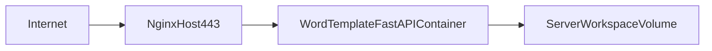

# Серверный деплой (опционально, future-track)

Этот документ нужен как заготовка для будущего деплоя на поддомен.

## Важное ограничение текущей архитектуры

Текущий `web-ui` принимает путь `workspace` и работает с файловой системой backend-процесса:

- локальный запуск: путь указывает на папку пользователя, всё работает;
- удалённый сервер: путь будет указывать на файловую систему сервера, а не пользователя.

Итог: в текущем виде серверный деплой подходит только для серверных данных, но не как прямой «удалённый доступ к локальной папке пользователя».

## Что можно переиспользовать из ваших практик (`knowledge-base-bot`)

- Паттерн `docker-compose.yml` + `docker-compose.prod.yml`.
- Привязка прод-порта приложения к `127.0.0.1`.
- Внешний Nginx reverse proxy на хосте.
- SSL через Let's Encrypt (`certbot`) на отдельный поддомен.

## Рекомендуемая минимальная схема



## Минимальные файлы в этом проекте

- `Dockerfile`
- `docker-compose.yml`
- `docker-compose.prod.yml`
- `nginx/word-template-generator.conf`

Это инфраструктурный baseline для дальнейших итераций.

## Шаги запуска (если понадобится)

1. Создать DNS-запись поддомен -> IP сервера.
2. Получить SSL-сертификат (`certbot`).
3. Положить Nginx-конфиг для поддомена.
4. Запустить контейнеры:

```bash
docker compose -f docker-compose.yml -f docker-compose.prod.yml up -d --build
```

## Что потребуется для полноценно удалённого UX

Нужна отдельная архитектура, один из вариантов:

- клиентская генерация DOCX в браузере (без server-side paths),
- upload/session-модель: загрузка файлов на сервер, генерация, выдача результата.

До этого момента основной поддерживаемый режим остаётся local-first.
